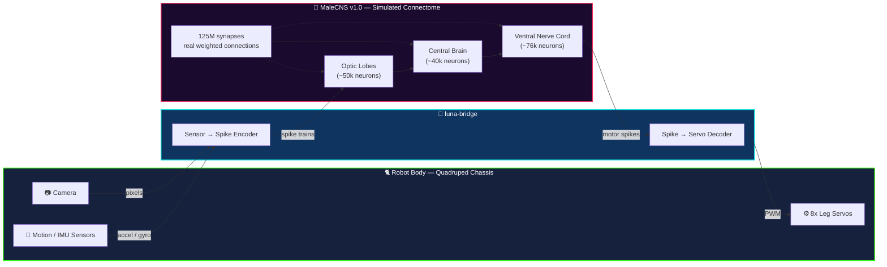
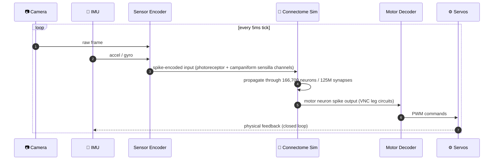

<div align="center">

```
██████╗ ██████╗  ██████╗      ██╗███████╗ ██████╗████████╗    ██╗     ██╗   ██╗███╗   ██╗ █████╗ 
██╔══██╗██╔══██╗██╔═══██╗     ██║██╔════╝██╔════╝╚══██╔══╝    ██║     ██║   ██║████╗  ██║██╔══██╗
██████╔╝██████╔╝██║   ██║     ██║█████╗  ██║        ██║       ██║     ██║   ██║██╔██╗ ██║███████║
██╔═══╝ ██╔══██╗██║   ██║██   ██║██╔══╝  ██║        ██║       ██║     ██║   ██║██║╚██╗██║██╔══██║
██║     ██║  ██║╚██████╔╝╚█████╔╝███████╗╚██████╗   ██║       ███████╗╚██████╔╝██║ ╚████║██║  ██║
╚═╝     ╚═╝  ╚═╝ ╚═════╝  ╚════╝ ╚══════╝ ╚═════╝   ╚═╝       ╚══════╝ ╚═════╝ ╚═╝  ╚═══╝╚═╝  ╚═╝
```

### 🪰 A real fly's nervous system, walking a robot body it was never born into.

*166,700 biological neurons. 125,000,000 real synapses. Zero lines of hand-written gait logic.*

[](https://www.cell.com)
[](https://www.cell.com)
[](#-faq)
[](#-how-it-works)
[](#-license)

[](#)
[](#)
[](#)


<sub>⚠️ Demo GIF path above is a placeholder — drop your own capture in `docs/media/luna-walk.gif` and it'll render here.</sub>

</div>

---

## ⚡ TL;DR

> On September 3, 2026, **Google Research** and **HHMI Janelia** published the first complete wiring
> diagram of an adult male fruit fly's entire central nervous system — brain, both optic lobes, and
> ventral nerve cord — in *Cell*. It's the largest single-animal nervous-system map ever built:
> **166,700 neurons**, **~125 million synapses**, mapped down to the individual connection.
>
> **Project Luna** takes that exact wiring diagram, runs it as a live spiking-neuron simulation, and
> wires the simulated sensory + motor neurons directly into a small robotic quadruped. A camera feeds
> the visual system. Motion sensors feed the mechanosensory pathways. The motor outputs drive servos.
>
> **Nobody coded a walk cycle.** The insect's own 400-million-year-old circuitry figures out balance
> and locomotion on legs it never evolved to have — because the *logic* it's running was never about
> legs in the first place. It's about turning sensory chaos into coordinated movement. We just changed
> what's plugged into the ends.

---

## 🧠 How It Works



<details>
<summary><b>🔬 What's actually simulated vs. what's real hardware (click to expand)</b></summary>
<br>

| Layer | What it is | Real or simulated? |
|---|---|---|
| Connectome topology | Every neuron + every synapse from the published MaleCNS v1.0 dataset | 🟢 **Real** — from the published *Cell* dataset |
| Neuron dynamics | Leaky integrate-and-fire spiking model per node | 🟡 Simulated approximation of biological firing |
| Synaptic weights | Connection strengths pulled from the EM reconstruction | 🟢 **Real** — actual measured connection counts |
| The fly | Any living tissue, cells, or biological material | 🔴 **None.** Nothing biological is alive in this loop |
| The body | 3D-printed quadruped chassis + off-the-shelf servos | 🟢 Real hardware, not insect-shaped |
| The gait | Hand-coded balance/locomotion logic | 🔴 **None written.** Emerges from the circuit itself |

</details>

---

## 🎬 Demo

<div align="center">

| First contact | Standing up | Full gait |
|:---:|:---:|:---:|
|  |  |  |
| spikes hit the motor cord | legs stiffen, no faceplant | 4-beat walking pattern, self-corrected |

</div>

---

## 📐 System Architecture



---

## 📁 Repo Structure

```
project-luna/
├── 🧬 connectome/
│   ├── malecns_v1.h5            # neuron + synapse graph (not included — see Data section)
│   ├── loader.py                 # parses the published connectome dataset
│   └── regions.yaml               # optic lobe / central brain / VNC region maps
│
├── ⚡ sim/
│   ├── lif_engine.cu              # GPU leaky integrate-and-fire spiking engine
│   ├── synapse_prop.py            # spike propagation across 125M weighted edges
│   └── realtime_scheduler.py      # keeps sim step under 5ms for closed-loop control
│
├── 🌉 bridge/
│   ├── sensor_encoder.py          # camera + IMU → spike trains
│   ├── motor_decoder.py           # VNC output spikes → servo PWM
│   └── channel_map.yaml           # which neuron IDs map to which I/O channel
│
├── 🐈 firmware/
│   ├── quadruped_hal.ino          # low-level servo + sensor hardware abstraction
│   └── failsafe.ino               # watchdog — kills power if spike rate goes pathological
│
├── 📊 monitor/
│   └── luna-dash/                 # live web dashboard: spike raster + 3D limb trace
│
├── docs/
│   ├── media/                     # gifs, renders, brain viz
│   └── ARCHITECTURE.md
│
├── tests/
├── requirements.txt
└── README.md
```

---

## 🚀 Quickstart

```bash
# clone it
git clone https://github.com/project-luna/project-luna.git
cd project-luna

# the connectome dataset itself is NOT bundled here — see "Data" below
python connectome/loader.py --fetch malecns_v1

# spin up the spiking simulation on GPU
python sim/realtime_scheduler.py --engine lif_engine.cu --target-hz 200

# bridge simulated motor cord output to the robot over serial
python bridge/motor_decoder.py --port /dev/ttyUSB0 --channel-map bridge/channel_map.yaml

# watch it think, live
cd monitor/luna-dash && npm install && npm run dev
```

<div align="center">
<sub>🟢 dashboard renders a live spike raster across all 166,700 neurons at ~30fps — your GPU will notice</sub>
</div>

---

## 🗺️ Roadmap

- [x] Parse full MaleCNS v1.0 graph (166,700 nodes / 125M edges) into a loadable sim format
- [x] Real-time LIF spiking engine hitting <5ms/tick on consumer GPU
- [x] Sensor encoder: camera frame → optic lobe spike trains
- [x] Motor decoder: ventral nerve cord output → 8-channel servo PWM
- [x] First unassisted stand
- [x] First unassisted 4-beat gait across a flat desk
- [ ] Closed-loop obstacle response (currently open-loop reflex only)
- [ ] Swap quadruped chassis for hexapod — closer to native leg count
- [ ] Live spike-raster overlay on brain mesh (`docs/media` render)
- [ ] Port sim engine to run on-device (Jetson) instead of tethered GPU box

---

## 📚 The Real Science (please read this part)

This project is a **hobbyist build**, not an official Google or HHMI Janelia release. The connectome
data it's built on is 100% real, though:

- **Dataset:** *MaleCNS v1.0* — the complete adult male *Drosophila melanogaster* central nervous
  system connectome (brain, both optic lobes, ventral nerve cord).
- **Published:** *Cell*, September 3, 2026, as a package of four papers — lead study:
  *"Sexual dimorphism in the complete connectome of the Drosophila male central nervous system."*
- **Built by:** Google Research, HHMI Janelia's FlyEM project, the MRC Laboratory of Molecular
  Biology, and the University of Cambridge Connectomics Group.
- **Scale:** ~166,700 neurons, ~125 million synapses — the largest complete single-animal nervous
  system map published to date, reconstructed from electron-microscope imaging with AI-assisted
  segmentation and human verification.
- **Explore the raw data yourself:** it's publicly browsable through Neuroglancer via the Janelia /
  FlyWire connectomics ecosystem.

This release also kicked off a wave of independent projects wiring the same connectome into other
substrates — driving gameplay in *Doom* and *Super Mario 64*, simulating fly movement inside
*Minecraft*, and now, here, into a physical quadruped. **Project Luna is one of those community
builds**, not a product of the original research groups.

---

## ❓ FAQ

<details>
<summary><b>Is there a living fly involved in any way?</b></summary>
<br>
No. Nothing biological is alive in this loop, at any point. The connectome is a digital wiring
diagram — a graph of which neurons connect to which, and how strongly — reconstructed from electron
microscope images of fly tissue. What's running on the robot is a computational simulation of that
graph, executed on ordinary silicon. The brain is real data. The body is borrowed hardware. Nothing
in between is alive.
</details>

<details>
<summary><b>Wait, so it's not really "thinking"?</b></summary>
<br>
It's running the same circuit topology and synaptic weights a real fly's nervous system uses to turn
sensory input into coordinated motor output. Whether that constitutes "thinking" is a real, open,
and genuinely unsettled question — reasonable people land in very different places on it, and this
README isn't going to resolve it for you.
</details>

<details>
<summary><b>Why a quadruped and not something with six legs, like an actual fly?</b></summary>
<br>
Mostly because a spare quadruped chassis was on hand. The ventral nerve cord's leg-control circuitry
doesn't "know" how many legs it's driving — it fires based on the sensory feedback it receives and
propagates that outward. Whatever's on the other end, walks or doesn't, is on it.
</details>

<details>
<summary><b>Can I run this without a GPU?</b></summary>
<br>
Technically yes, in software-only mode with <code>--engine cpu_fallback</code>, but expect sim rate
to drop well below the 5ms/tick needed for stable closed-loop balance. Fine for offline analysis,
rough for live locomotion.
</details>

---

## 🤝 Contributing

PRs welcome, especially on the obstacle-response closed loop and the hexapod port. Please open an
issue before large changes — the sensor/motor channel mapping is fiddly and easy to desync.

## 📄 License

MIT for all code in this repo. The underlying MaleCNS v1.0 connectome dataset carries its own
license from the publishing institutions — check their terms before redistributing the raw data.

## 🙏 Acknowledgments

All credit for the actual neuroscience goes to Google Research, HHMI Janelia's FlyEM team, the MRC
Laboratory of Molecular Biology, and the University of Cambridge Connectomics Group. This repo just
plugs their decade-plus of work into a robot for fun.

<div align="center">

---

**Project Luna** — *the brain is real, the body is borrowed.*

</div>
